# Individual project for Data Science for Biologists course

This script contains (almost) all information for the course project
including:  
\* Exploratory data analysis  
\* Math model  
\* Model fit  
\* Prior justification  
\* Model diagnostics  
\* Model inferences  
\* Conclusions

**A more detailed overview of the dataset of interest, study design, and
goals can be found in the markdown script project\_overview.md (includes
sketch of data design)**

-----

## Exploratory Data Analysis

**Data was pre-processed to tidy format in the script data\_prep.Rmd**
In this section, the data is explored using graphics in ggplot.

``` r
#Load libraries required for the whole script
library(rstanarm)
```

    ## Warning: package 'rstanarm' was built under R version 4.0.5

    ## Loading required package: Rcpp

    ## Warning: replacing previous import 'lifecycle::last_warnings' by
    ## 'rlang::last_warnings' when loading 'tibble'

    ## Warning: replacing previous import 'lifecycle::last_warnings' by
    ## 'rlang::last_warnings' when loading 'pillar'

    ## This is rstanarm version 2.21.3

    ## - See https://mc-stan.org/rstanarm/articles/priors for changes to default priors!

    ## - Default priors may change, so it's safest to specify priors, even if equivalent to the defaults.

    ## - For execution on a local, multicore CPU with excess RAM we recommend calling

    ##   options(mc.cores = parallel::detectCores())

``` r
options(mc.cores = parallel::detectCores())
library(dplyr)
```

    ## Warning: package 'dplyr' was built under R version 4.0.5

    ## 
    ## Attaching package: 'dplyr'

    ## The following objects are masked from 'package:stats':
    ## 
    ##     filter, lag

    ## The following objects are masked from 'package:base':
    ## 
    ##     intersect, setdiff, setequal, union

``` r
library(tidyr)
```

    ## Warning: package 'tidyr' was built under R version 4.0.5

``` r
library(ggplot2)
```

    ## Warning: package 'ggplot2' was built under R version 4.0.5

``` r
theme_set(theme_bw())

source("../source/hpdi.R")

#Load in data 
load("../individual_project/tidy_df.Rdata")
```

1.  Examine the data

<!-- end list -->

``` r
#head(View(tidy_df))
```

2.  Visualizing the data Plot of total alleles present in simulation
    replicates to see the distribution of variation between replicates
    Each bar represents a different count of alleles The 3 increments on
    the plot show the allele count being present in one, two, or three
    different simulations by chance However, most replicates model a
    different number of total alleles due to the stochastic simulations

<!-- end list -->

``` r
ggplot(tidy_df, aes(x=as.numeric(total_alleles))) +
    geom_bar() +
    theme(axis.text.x=element_blank(),
          axis.ticks.x=element_blank(),
          axis.text.y=element_blank(),
          axis.ticks.y=element_blank())
```

<!-- -->

Showing a table of all instances of total alleles present in simulations
Occurence values of 2805 = present in 1 independent simulation (935
scenarios x pollen donors = 1 simulation) Occurence values of 5610 =
present in 2 independent simulations Occurence values of 8415 = present
in 3 independent simulations Also, the total alleles simulated in
simulations ranges from 235 to 288 –this results in variation during
sampling as well, for the same sample size of 50 seeds, you may capture
more diversity in the simulation with 235 alleles than 288 total alleles

``` r
table(tidy_df$total_alleles)
```

    ## 
    ##  235  240  242  243  244  249  250  251  252  253  254  255  256  257  259  260 
    ## 2805 2805 2805 2805 5610 2805 2805 5610 2805 2805 2805 8415 5610 5610 2805 5610 
    ##  261  263  264  265  266  267  268  269  272  274  275  276  278  279  280  282 
    ## 2805 5610 2805 2805 5610 2805 2805 8415 5610 5610 2805 2805 5610 2805 2805 2805 
    ##  284  285  286  288 
    ## 2805 2805 2805 2805

**Plotting all the data\!** Plot proportion of alleles captured vs total
number of seeds sampled for each number of maternal trees Here we see
that in scenarios with fewer maternal trees sampled (facet 1, 2), there
are greater differences in the proportion of alleles captured between
pollen donor scenarios (large difference between the curves) In
scenarios with more maternal trees sampled (facet 50, 100), similar
proportion of alleles are captured across donor types (though there is
less information here with fewer scenarios). Additionally, comparing a
given pollen donor type across varying number of trees sampled (compare
a color across facets), we see that when more maternal trees are
sampled, much more diversity is captured (curve gets higher–greater
proportion of alleles captured ). Lastly, when more seeds are sampled
per tree (going along the x-axis), we see a slight increase in the
diversity captured (see curves upward)

``` r
tidy_df %>% 
    ggplot(aes(x=as.numeric(total_seeds), y=as.numeric(prop_capt), color=donor_type)) +
    geom_point(alpha=0.25) +
    facet_wrap(vars(maternal_trees)) +
    ylim(0,1)
```

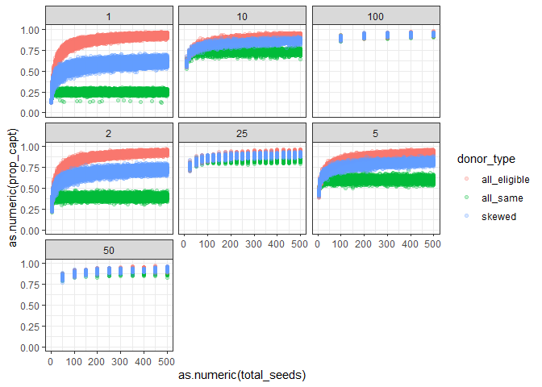<!-- -->

Inspecting scenarios more closely–100 seeds total sampled, faceted by
number of maternal trees sampled again and proportion of alleles
captured on the y-axis (plotted with jitter to spread points across
x-axis) Again, we see the trend of pollen donor type appearing to have
more influence on the proportion of alleles captured in scenarios with
fewer maternal trees sampled, since most of the diversity would be
coming from pollen donors in these cases.

``` r
tidy_df %>% 
    filter(total_seeds==100) %>% 
    ggplot(aes(x=as.numeric(total_seeds), y=as.numeric(prop_capt), color=donor_type)) +
    geom_point(alpha=0.25) +
    facet_wrap(vars(maternal_trees)) +
    ylim(0,1) +
    geom_jitter() 
```

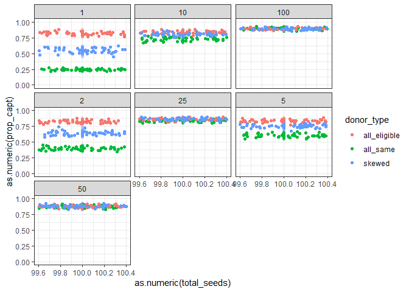<!-- -->

Boxplots of specific scenarios for each \# of maternal tree sampled, 100
total seeds sampled Again, this shows the variation in alleles captured
for each pollen donor type in scenarios with fewer maternal trees When
many maternal trees are sampled, there is no difference in diversity
captured

``` r
tidy_df %>% 
    filter(total_seeds==100) %>% 
    ggplot(aes(x=as.numeric(total_seeds), y=as.numeric(prop_capt), color=donor_type)) +
    geom_boxplot(alpha=0.25) +
    facet_wrap(vars(maternal_trees)) +
    ylim(0,1) 
```

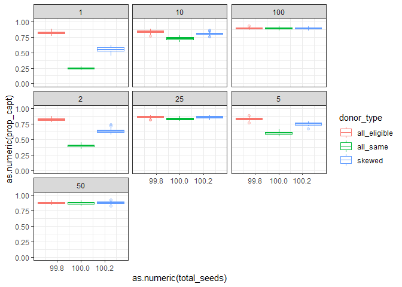<!-- -->

Plotting a scenario of 1 maternal tree sampled to better view the curve
of the data

``` r
tidy_df %>% 
    filter(maternal_trees==1) %>% 
    ggplot(aes(x=as.numeric(total_seeds), y=as.numeric(prop_capt), color=donor_type)) +
    geom_point(alpha=0.25) +
    facet_wrap(vars(maternal_trees)) +
    ylim(0,1)
```

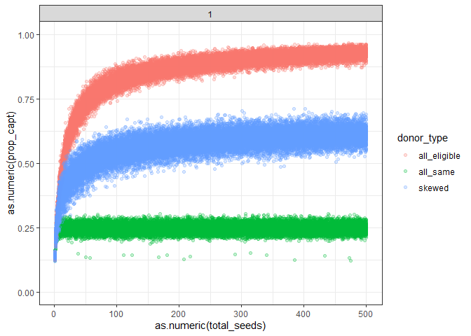<!-- -->

-----

## Math model

The response variable is the proportion of alleles captured, which is a
binomially distributed variable (success of capturing an allele, vs. the
failure of not capturing it–here represented as a proportion). We have
one trial, as the sampling scenarios are done only 1 time each for each
simulation replicate (which is the grouping variable). That is–each
sampling scenario is done 1 time per group.  
  
![
y\_{i} \\sim\\ Binomial(p\_{j\[i\]}, N=1)
](https://latex.codecogs.com/png.image?%5Cdpi%7B110%7D&space;%5Cbg_white&space;%0Ay_%7Bi%7D%20%5Csim%5C%20Binomial%28p_%7Bj%5Bi%5D%7D%2C%20N%3D1%29%0A
"
y_{i} \\sim\\ Binomial(p_{j[i]}, N=1)
")  
The predictor variables are the total seeds sampled, number of maternal
trees sampled, and pollen donor type. Maternal trees sampled and pollen
donor type are both factors with various levels (7 and 3 levels
respectively). I have included interactions between all predictor
variables to get parameter estimates for each different number of
maternal tree sampled and each pollen donation type. The grouping
variable is the simulation replicate, as each sampling scenario is
repeated for all simulation replicates, and there is some variation
between simulation replicates in terms of the number of alleles
simulated (see EDA). \[j\] represents the grouping term, simulation
replicate, and \[i\] represents the different sampling scenarios within
those group.  
Here I am using a logit link function to model the data–representing the
log probability of capturing an allele vs. the probability of not
capturing the allele for a given sample size.

  
![
ln(\\frac {p\_{j\[i\]}}{1-p\_{j\[i\]}}) = \\alpha \_{j\[i\]} + \\beta
\_{1j\[i\]}X\_{i1} + \\beta \_{2j\[i\]}X\_{i1}^2 +...+
\\beta\_{40j\[i\]}
](https://latex.codecogs.com/png.image?%5Cdpi%7B110%7D&space;%5Cbg_white&space;%0Aln%28%5Cfrac%20%7Bp_%7Bj%5Bi%5D%7D%7D%7B1-p_%7Bj%5Bi%5D%7D%7D%29%20%20%3D%20%5Calpha%20_%7Bj%5Bi%5D%7D%20%2B%20%5Cbeta%20_%7B1j%5Bi%5D%7DX_%7Bi1%7D%20%2B%20%5Cbeta%20_%7B2j%5Bi%5D%7DX_%7Bi1%7D%5E2%20%2B...%2B%20%5Cbeta_%7B40j%5Bi%5D%7D%0A
"
ln(\\frac {p_{j[i]}}{1-p_{j[i]}})  = \\alpha _{j[i]} + \\beta _{1j[i]}X_{i1} + \\beta _{2j[i]}X_{i1}^2 +...+ \\beta_{40j[i]}
")  
There are 41 total parameters
( represents the intercept, and slopes are represented by
), including all predictors and their interactions.
Additionally, both the intercept and slopes can vary across groups
\[j\]:   

")  
  

")  

-----

## Model Fit

Fitting a Bayesian GLMM with a binomial response variable on less than
10% of the total dataset due to time crunch and computational
constraints. Here, some of this code is commented out since it takes so
long to compile, so I’m just pulling the model fit from a previous run
that I saved in an Rdata file (the code used to generate that result is
the exact same as shown here)

``` r
#Converting these to numeric--they already should be, but they must have been converted accidentally when making the matrix a dataframe, etc...
# tidy_df$prop_capt = as.numeric(tidy_df$prop_capt)
# tidy_df$total_seeds = as.numeric(tidy_df$total_seeds)
# #Subsetting the data to use 10% of the actual dataset (for time crunch purposes)
# subset_data = tidy_df[sample(nrow(tidy_df), 10000),]
# #Running the model
# final_model = stan_glmer(prop_capt ~ total_seeds * maternal_trees * donor_type + (1|replicate),
#                          weights=total_seeds, family = binomial(link='logit'), data = subset_data, 
#                          iter = 5000)
# #Save the model since it takes so long to run
# save(subset_data, final_model, file = "../individual_project/final_model.Rdata")
#Load the model from previously saved run
load("../individual_project/final_model.Rdata")
#Model summary! 
summary(final_model, digits = 4)
```

    ## 
    ## Model Info:
    ##  function:     stan_glmer
    ##  family:       binomial [logit]
    ##  formula:      prop_capt ~ total_seeds * maternal_trees * donor_type + (1 | 
    ##     replicate)
    ##  algorithm:    sampling
    ##  sample:       10000 (posterior sample size)
    ##  priors:       see help('prior_summary')
    ##  observations: 10000
    ##  groups:       replicate (50)
    ## 
    ## Estimates:
    ##                                                    mean    sd      10%  
    ## (Intercept)                                       1.2113  0.0172  1.1895
    ## total_seeds                                       0.0030  0.0000  0.0030
    ## maternal_trees10                                  0.2062  0.0439  0.1501
    ## maternal_trees100                                 0.8642  0.1466  0.6784
    ## maternal_trees2                                   0.0265  0.0226 -0.0020
    ## maternal_trees25                                  0.3792  0.0698  0.2905
    ## maternal_trees5                                   0.1205  0.0320  0.0793
    ## maternal_trees50                                  0.7118  0.1164  0.5623
    ## donor_typeall_same                               -2.3641  0.0168 -2.3857
    ## donor_typeskewed                                 -1.0978  0.0161 -1.1185
    ## total_seeds:maternal_trees10                     -0.0005  0.0001 -0.0007
    ## total_seeds:maternal_trees100                    -0.0017  0.0004 -0.0023
    ## total_seeds:maternal_trees2                      -0.0001  0.0001 -0.0002
    ## total_seeds:maternal_trees25                     -0.0007  0.0002 -0.0010
    ## total_seeds:maternal_trees5                      -0.0004  0.0001 -0.0005
    ## total_seeds:maternal_trees50                     -0.0014  0.0003 -0.0019
    ## total_seeds:donor_typeall_same                   -0.0030  0.0001 -0.0030
    ## total_seeds:donor_typeskewed                     -0.0023  0.0000 -0.0023
    ## maternal_trees10:donor_typeall_same               1.8943  0.0551  1.8241
    ## maternal_trees100:donor_typeall_same              2.5033  0.2578  2.1733
    ## maternal_trees2:donor_typeall_same                0.6648  0.0281  0.6286
    ## maternal_trees25:donor_typeall_same               2.3169  0.0897  2.2009
    ## maternal_trees5:donor_typeall_same                1.4183  0.0399  1.3668
    ## maternal_trees50:donor_typeall_same               2.4522  0.1607  2.2432
    ## maternal_trees10:donor_typeskewed                 0.9483  0.0584  0.8731
    ## maternal_trees100:donor_typeskewed                1.3461  0.2810  0.9888
    ## maternal_trees2:donor_typeskewed                  0.3786  0.0280  0.3422
    ## maternal_trees25:donor_typeskewed                 1.1233  0.0972  0.9977
    ## maternal_trees5:donor_typeskewed                  0.7488  0.0410  0.6961
    ## maternal_trees50:donor_typeskewed                 1.0246  0.1485  0.8349
    ## total_seeds:maternal_trees10:donor_typeall_same   0.0006  0.0002  0.0004
    ## total_seeds:maternal_trees100:donor_typeall_same  0.0022  0.0007  0.0013
    ## total_seeds:maternal_trees2:donor_typeall_same    0.0000  0.0001 -0.0001
    ## total_seeds:maternal_trees25:donor_typeall_same   0.0009  0.0003  0.0006
    ## total_seeds:maternal_trees5:donor_typeall_same    0.0003  0.0001  0.0001
    ## total_seeds:maternal_trees50:donor_typeall_same   0.0016  0.0005  0.0010
    ## total_seeds:maternal_trees10:donor_typeskewed     0.0009  0.0002  0.0007
    ## total_seeds:maternal_trees100:donor_typeskewed    0.0018  0.0007  0.0009
    ## total_seeds:maternal_trees2:donor_typeskewed      0.0003  0.0001  0.0002
    ## total_seeds:maternal_trees25:donor_typeskewed     0.0011  0.0003  0.0007
    ## total_seeds:maternal_trees5:donor_typeskewed      0.0007  0.0001  0.0005
    ## total_seeds:maternal_trees50:donor_typeskewed     0.0022  0.0004  0.0016
    ## b[(Intercept) replicate:1]                       -0.0738  0.0156 -0.0938
    ## b[(Intercept) replicate:10]                       0.0287  0.0154  0.0087
    ## b[(Intercept) replicate:11]                       0.0133  0.0152 -0.0064
    ## b[(Intercept) replicate:12]                      -0.0054  0.0157 -0.0256
    ## b[(Intercept) replicate:13]                       0.0122  0.0151 -0.0071
    ## b[(Intercept) replicate:14]                       0.1582  0.0157  0.1379
    ## b[(Intercept) replicate:15]                      -0.0518  0.0159 -0.0721
    ## b[(Intercept) replicate:16]                      -0.1355  0.0156 -0.1557
    ## b[(Intercept) replicate:17]                       0.1077  0.0154  0.0882
    ## b[(Intercept) replicate:18]                       0.0621  0.0153  0.0424
    ## b[(Intercept) replicate:19]                       0.0593  0.0151  0.0401
    ## b[(Intercept) replicate:2]                        0.1855  0.0152  0.1659
    ## b[(Intercept) replicate:20]                      -0.0498  0.0153 -0.0695
    ## b[(Intercept) replicate:21]                      -0.0400  0.0159 -0.0605
    ## b[(Intercept) replicate:22]                      -0.1110  0.0153 -0.1304
    ## b[(Intercept) replicate:23]                      -0.1052  0.0153 -0.1250
    ## b[(Intercept) replicate:24]                      -0.0423  0.0153 -0.0622
    ## b[(Intercept) replicate:25]                       0.0988  0.0150  0.0795
    ## b[(Intercept) replicate:26]                      -0.0265  0.0147 -0.0459
    ## b[(Intercept) replicate:27]                      -0.0746  0.0162 -0.0956
    ## b[(Intercept) replicate:28]                       0.1167  0.0158  0.0962
    ## b[(Intercept) replicate:29]                      -0.0103  0.0156 -0.0304
    ## b[(Intercept) replicate:3]                       -0.0377  0.0152 -0.0575
    ## b[(Intercept) replicate:30]                       0.0605  0.0158  0.0402
    ## b[(Intercept) replicate:31]                      -0.0032  0.0158 -0.0238
    ## b[(Intercept) replicate:32]                      -0.0031  0.0159 -0.0239
    ## b[(Intercept) replicate:33]                      -0.1407  0.0154 -0.1606
    ## b[(Intercept) replicate:34]                       0.1067  0.0154  0.0868
    ## b[(Intercept) replicate:35]                       0.0481  0.0157  0.0278
    ## b[(Intercept) replicate:36]                       0.0621  0.0155  0.0421
    ## b[(Intercept) replicate:37]                      -0.0820  0.0155 -0.1023
    ## b[(Intercept) replicate:38]                      -0.0134  0.0152 -0.0326
    ## b[(Intercept) replicate:39]                      -0.0373  0.0154 -0.0572
    ## b[(Intercept) replicate:4]                        0.0279  0.0154  0.0078
    ## b[(Intercept) replicate:40]                       0.0863  0.0155  0.0663
    ## b[(Intercept) replicate:41]                      -0.0224  0.0157 -0.0425
    ## b[(Intercept) replicate:42]                      -0.1078  0.0156 -0.1278
    ## b[(Intercept) replicate:43]                      -0.1574  0.0152 -0.1773
    ## b[(Intercept) replicate:44]                       0.0356  0.0156  0.0153
    ## b[(Intercept) replicate:45]                       0.0300  0.0152  0.0099
    ## b[(Intercept) replicate:46]                      -0.0325  0.0156 -0.0527
    ## b[(Intercept) replicate:47]                      -0.0452  0.0161 -0.0657
    ## b[(Intercept) replicate:48]                      -0.0334  0.0158 -0.0537
    ## b[(Intercept) replicate:49]                       0.0430  0.0156  0.0230
    ## b[(Intercept) replicate:5]                        0.0647  0.0153  0.0449
    ## b[(Intercept) replicate:50]                       0.0230  0.0157  0.0027
    ## b[(Intercept) replicate:6]                       -0.0105  0.0152 -0.0301
    ## b[(Intercept) replicate:7]                       -0.0375  0.0153 -0.0573
    ## b[(Intercept) replicate:8]                       -0.0154  0.0160 -0.0356
    ## b[(Intercept) replicate:9]                        0.0707  0.0154  0.0508
    ## Sigma[replicate:(Intercept),(Intercept)]          0.0062  0.0013  0.0047
    ##                                                    50%     90%  
    ## (Intercept)                                       1.2112  1.2336
    ## total_seeds                                       0.0030  0.0031
    ## maternal_trees10                                  0.2059  0.2631
    ## maternal_trees100                                 0.8624  1.0531
    ## maternal_trees2                                   0.0258  0.0561
    ## maternal_trees25                                  0.3785  0.4691
    ## maternal_trees5                                   0.1205  0.1619
    ## maternal_trees50                                  0.7104  0.8607
    ## donor_typeall_same                               -2.3643 -2.3426
    ## donor_typeskewed                                 -1.0976 -1.0772
    ## total_seeds:maternal_trees10                     -0.0005 -0.0004
    ## total_seeds:maternal_trees100                    -0.0017 -0.0012
    ## total_seeds:maternal_trees2                      -0.0001  0.0000
    ## total_seeds:maternal_trees25                     -0.0007 -0.0005
    ## total_seeds:maternal_trees5                      -0.0004 -0.0002
    ## total_seeds:maternal_trees50                     -0.0014 -0.0010
    ## total_seeds:donor_typeall_same                   -0.0030 -0.0029
    ## total_seeds:donor_typeskewed                     -0.0023 -0.0022
    ## maternal_trees10:donor_typeall_same               1.8941  1.9657
    ## maternal_trees100:donor_typeall_same              2.5016  2.8342
    ## maternal_trees2:donor_typeall_same                0.6652  0.7005
    ## maternal_trees25:donor_typeall_same               2.3173  2.4314
    ## maternal_trees5:donor_typeall_same                1.4188  1.4697
    ## maternal_trees50:donor_typeall_same               2.4529  2.6581
    ## maternal_trees10:donor_typeskewed                 0.9475  1.0243
    ## maternal_trees100:donor_typeskewed                1.3437  1.7078
    ## maternal_trees2:donor_typeskewed                  0.3787  0.4145
    ## maternal_trees25:donor_typeskewed                 1.1233  1.2465
    ## maternal_trees5:donor_typeskewed                  0.7489  0.8004
    ## maternal_trees50:donor_typeskewed                 1.0251  1.2156
    ## total_seeds:maternal_trees10:donor_typeall_same   0.0006  0.0008
    ## total_seeds:maternal_trees100:donor_typeall_same  0.0022  0.0031
    ## total_seeds:maternal_trees2:donor_typeall_same    0.0000  0.0001
    ## total_seeds:maternal_trees25:donor_typeall_same   0.0009  0.0012
    ## total_seeds:maternal_trees5:donor_typeall_same    0.0003  0.0004
    ## total_seeds:maternal_trees50:donor_typeall_same   0.0016  0.0022
    ## total_seeds:maternal_trees10:donor_typeskewed     0.0009  0.0011
    ## total_seeds:maternal_trees100:donor_typeskewed    0.0018  0.0027
    ## total_seeds:maternal_trees2:donor_typeskewed      0.0003  0.0004
    ## total_seeds:maternal_trees25:donor_typeskewed     0.0011  0.0015
    ## total_seeds:maternal_trees5:donor_typeskewed      0.0007  0.0008
    ## total_seeds:maternal_trees50:donor_typeskewed     0.0022  0.0027
    ## b[(Intercept) replicate:1]                       -0.0737 -0.0540
    ## b[(Intercept) replicate:10]                       0.0288  0.0485
    ## b[(Intercept) replicate:11]                       0.0135  0.0327
    ## b[(Intercept) replicate:12]                      -0.0053  0.0149
    ## b[(Intercept) replicate:13]                       0.0124  0.0314
    ## b[(Intercept) replicate:14]                       0.1583  0.1781
    ## b[(Intercept) replicate:15]                      -0.0517 -0.0316
    ## b[(Intercept) replicate:16]                      -0.1353 -0.1157
    ## b[(Intercept) replicate:17]                       0.1076  0.1273
    ## b[(Intercept) replicate:18]                       0.0623  0.0820
    ## b[(Intercept) replicate:19]                       0.0594  0.0784
    ## b[(Intercept) replicate:2]                        0.1857  0.2049
    ## b[(Intercept) replicate:20]                      -0.0497 -0.0304
    ## b[(Intercept) replicate:21]                      -0.0399 -0.0196
    ## b[(Intercept) replicate:22]                      -0.1109 -0.0914
    ## b[(Intercept) replicate:23]                      -0.1051 -0.0854
    ## b[(Intercept) replicate:24]                      -0.0420 -0.0226
    ## b[(Intercept) replicate:25]                       0.0991  0.1177
    ## b[(Intercept) replicate:26]                      -0.0262 -0.0077
    ## b[(Intercept) replicate:27]                      -0.0746 -0.0538
    ## b[(Intercept) replicate:28]                       0.1169  0.1365
    ## b[(Intercept) replicate:29]                      -0.0100  0.0095
    ## b[(Intercept) replicate:3]                       -0.0376 -0.0183
    ## b[(Intercept) replicate:30]                       0.0606  0.0806
    ## b[(Intercept) replicate:31]                      -0.0030  0.0170
    ## b[(Intercept) replicate:32]                      -0.0029  0.0174
    ## b[(Intercept) replicate:33]                      -0.1406 -0.1212
    ## b[(Intercept) replicate:34]                       0.1068  0.1262
    ## b[(Intercept) replicate:35]                       0.0480  0.0680
    ## b[(Intercept) replicate:36]                       0.0622  0.0819
    ## b[(Intercept) replicate:37]                      -0.0816 -0.0621
    ## b[(Intercept) replicate:38]                      -0.0132  0.0059
    ## b[(Intercept) replicate:39]                      -0.0371 -0.0174
    ## b[(Intercept) replicate:4]                        0.0280  0.0476
    ## b[(Intercept) replicate:40]                       0.0865  0.1060
    ## b[(Intercept) replicate:41]                      -0.0225 -0.0021
    ## b[(Intercept) replicate:42]                      -0.1075 -0.0878
    ## b[(Intercept) replicate:43]                      -0.1570 -0.1382
    ## b[(Intercept) replicate:44]                       0.0359  0.0556
    ## b[(Intercept) replicate:45]                       0.0303  0.0496
    ## b[(Intercept) replicate:46]                      -0.0325 -0.0126
    ## b[(Intercept) replicate:47]                      -0.0451 -0.0247
    ## b[(Intercept) replicate:48]                      -0.0333 -0.0134
    ## b[(Intercept) replicate:49]                       0.0433  0.0627
    ## b[(Intercept) replicate:5]                        0.0649  0.0840
    ## b[(Intercept) replicate:50]                       0.0233  0.0431
    ## b[(Intercept) replicate:6]                       -0.0103  0.0086
    ## b[(Intercept) replicate:7]                       -0.0373 -0.0181
    ## b[(Intercept) replicate:8]                       -0.0155  0.0050
    ## b[(Intercept) replicate:9]                        0.0707  0.0903
    ## Sigma[replicate:(Intercept),(Intercept)]          0.0060  0.0079
    ## 
    ## Fit Diagnostics:
    ##            mean     sd       10%      50%      90%   
    ## mean_PPD 161.1409   0.0930 161.0216 161.1407 161.2606
    ## 
    ## The mean_ppd is the sample average posterior predictive distribution of the outcome variable (for details see help('summary.stanreg')).
    ## 
    ## MCMC diagnostics
    ##                                                  mcse   Rhat   n_eff
    ## (Intercept)                                      0.0007 1.0052  623 
    ## total_seeds                                      0.0000 1.0014 1879 
    ## maternal_trees10                                 0.0009 1.0005 2191 
    ## maternal_trees100                                0.0028 1.0012 2795 
    ## maternal_trees2                                  0.0005 1.0019 1768 
    ## maternal_trees25                                 0.0015 1.0004 2184 
    ## maternal_trees5                                  0.0007 1.0025 2046 
    ## maternal_trees50                                 0.0023 1.0010 2567 
    ## donor_typeall_same                               0.0004 1.0010 2103 
    ## donor_typeskewed                                 0.0004 1.0014 2051 
    ## total_seeds:maternal_trees10                     0.0000 1.0005 2217 
    ## total_seeds:maternal_trees100                    0.0000 1.0013 2772 
    ## total_seeds:maternal_trees2                      0.0000 1.0019 1794 
    ## total_seeds:maternal_trees25                     0.0000 1.0007 2123 
    ## total_seeds:maternal_trees5                      0.0000 1.0024 1935 
    ## total_seeds:maternal_trees50                     0.0000 1.0010 2548 
    ## total_seeds:donor_typeall_same                   0.0000 1.0012 1967 
    ## total_seeds:donor_typeskewed                     0.0000 1.0015 1954 
    ## maternal_trees10:donor_typeall_same              0.0011 1.0002 2470 
    ## maternal_trees100:donor_typeall_same             0.0046 1.0015 3136 
    ## maternal_trees2:donor_typeall_same               0.0006 1.0014 1985 
    ## maternal_trees25:donor_typeall_same              0.0018 1.0004 2421 
    ## maternal_trees5:donor_typeall_same               0.0008 1.0022 2230 
    ## maternal_trees50:donor_typeall_same              0.0029 1.0008 3016 
    ## maternal_trees10:donor_typeskewed                0.0012 1.0003 2485 
    ## maternal_trees100:donor_typeskewed               0.0049 1.0004 3352 
    ## maternal_trees2:donor_typeskewed                 0.0006 1.0021 1962 
    ## maternal_trees25:donor_typeskewed                0.0019 1.0000 2599 
    ## maternal_trees5:donor_typeskewed                 0.0008 1.0023 2370 
    ## maternal_trees50:donor_typeskewed                0.0028 1.0005 2831 
    ## total_seeds:maternal_trees10:donor_typeall_same  0.0000 1.0002 2454 
    ## total_seeds:maternal_trees100:donor_typeall_same 0.0000 1.0018 3013 
    ## total_seeds:maternal_trees2:donor_typeall_same   0.0000 1.0013 1929 
    ## total_seeds:maternal_trees25:donor_typeall_same  0.0000 1.0007 2367 
    ## total_seeds:maternal_trees5:donor_typeall_same   0.0000 1.0021 2094 
    ## total_seeds:maternal_trees50:donor_typeall_same  0.0000 1.0009 2978 
    ## total_seeds:maternal_trees10:donor_typeskewed    0.0000 1.0003 2461 
    ## total_seeds:maternal_trees100:donor_typeskewed   0.0000 1.0005 3097 
    ## total_seeds:maternal_trees2:donor_typeskewed     0.0000 1.0020 1921 
    ## total_seeds:maternal_trees25:donor_typeskewed    0.0000 1.0001 2465 
    ## total_seeds:maternal_trees5:donor_typeskewed     0.0000 1.0021 2268 
    ## total_seeds:maternal_trees50:donor_typeskewed    0.0000 1.0006 2758 
    ## b[(Intercept) replicate:1]                       0.0006 1.0035  668 
    ## b[(Intercept) replicate:10]                      0.0006 1.0039  643 
    ## b[(Intercept) replicate:11]                      0.0006 1.0038  677 
    ## b[(Intercept) replicate:12]                      0.0006 1.0028  645 
    ## b[(Intercept) replicate:13]                      0.0006 1.0047  591 
    ## b[(Intercept) replicate:14]                      0.0006 1.0031  703 
    ## b[(Intercept) replicate:15]                      0.0006 1.0028  716 
    ## b[(Intercept) replicate:16]                      0.0006 1.0050  658 
    ## b[(Intercept) replicate:17]                      0.0006 1.0040  648 
    ## b[(Intercept) replicate:18]                      0.0006 1.0030  646 
    ## b[(Intercept) replicate:19]                      0.0006 1.0042  650 
    ## b[(Intercept) replicate:2]                       0.0006 1.0037  631 
    ## b[(Intercept) replicate:20]                      0.0006 1.0039  636 
    ## b[(Intercept) replicate:21]                      0.0006 1.0044  665 
    ## b[(Intercept) replicate:22]                      0.0006 1.0043  662 
    ## b[(Intercept) replicate:23]                      0.0006 1.0044  646 
    ## b[(Intercept) replicate:24]                      0.0006 1.0035  676 
    ## b[(Intercept) replicate:25]                      0.0006 1.0037  624 
    ## b[(Intercept) replicate:26]                      0.0006 1.0044  614 
    ## b[(Intercept) replicate:27]                      0.0006 1.0033  767 
    ## b[(Intercept) replicate:28]                      0.0006 1.0037  683 
    ## b[(Intercept) replicate:29]                      0.0006 1.0042  677 
    ## b[(Intercept) replicate:3]                       0.0006 1.0046  614 
    ## b[(Intercept) replicate:30]                      0.0006 1.0027  681 
    ## b[(Intercept) replicate:31]                      0.0006 1.0049  689 
    ## b[(Intercept) replicate:32]                      0.0006 1.0039  671 
    ## b[(Intercept) replicate:33]                      0.0006 1.0041  665 
    ## b[(Intercept) replicate:34]                      0.0006 1.0045  675 
    ## b[(Intercept) replicate:35]                      0.0006 1.0033  687 
    ## b[(Intercept) replicate:36]                      0.0006 1.0039  690 
    ## b[(Intercept) replicate:37]                      0.0006 1.0040  625 
    ## b[(Intercept) replicate:38]                      0.0006 1.0036  629 
    ## b[(Intercept) replicate:39]                      0.0006 1.0031  668 
    ## b[(Intercept) replicate:4]                       0.0006 1.0029  674 
    ## b[(Intercept) replicate:40]                      0.0006 1.0037  666 
    ## b[(Intercept) replicate:41]                      0.0006 1.0042  696 
    ## b[(Intercept) replicate:42]                      0.0006 1.0038  676 
    ## b[(Intercept) replicate:43]                      0.0006 1.0036  638 
    ## b[(Intercept) replicate:44]                      0.0006 1.0038  643 
    ## b[(Intercept) replicate:45]                      0.0006 1.0044  622 
    ## b[(Intercept) replicate:46]                      0.0006 1.0030  677 
    ## b[(Intercept) replicate:47]                      0.0006 1.0032  717 
    ## b[(Intercept) replicate:48]                      0.0006 1.0029  690 
    ## b[(Intercept) replicate:49]                      0.0006 1.0048  669 
    ## b[(Intercept) replicate:5]                       0.0006 1.0030  647 
    ## b[(Intercept) replicate:50]                      0.0006 1.0032  660 
    ## b[(Intercept) replicate:6]                       0.0006 1.0041  643 
    ## b[(Intercept) replicate:7]                       0.0006 1.0032  674 
    ## b[(Intercept) replicate:8]                       0.0006 1.0035  689 
    ## b[(Intercept) replicate:9]                       0.0006 1.0034  635 
    ## Sigma[replicate:(Intercept),(Intercept)]         0.0000 1.0043  760 
    ## mean_PPD                                         0.0009 0.9998 9970 
    ## log-posterior                                    0.2442 1.0030 1192 
    ## 
    ## For each parameter, mcse is Monte Carlo standard error, n_eff is a crude measure of effective sample size, and Rhat is the potential scale reduction factor on split chains (at convergence Rhat=1).

The summary output gives us all the model parameter estimates that we
want, intercepts and slopes. There are a lot of parameters since we have
3 predictor variables, two of which are factors with various levels
(donor type and maternal trees sampled). The grouping variable,
simulation replicate, adds 50 parameters as well. We don’t see much
difference in the mean estimates for all the simulation replicates–this
means the amount of variation attributed to this grouping variable is
quite low. However, it’s still necessary to add this to the model. The
number of effective samples is still a bit low for the grouping terms,
even after increasing iterations to 5000, but I can’t increase it more
due to time constraints. So take the rest of the results with a grain of
salt\! However, to make these results more robust, I would increase
iterations to give a higher number of effective samples (around 1000)
for the simulation replicate estimates.

-----

## Plotting the fitted model with the data:

To verify if the model represents the real data, here I have plotted the
data with the fitted model:

``` r
#Creating a new dataframe of values to base predictions on 
newd = data.frame(maternal_trees=factor(rep(c(1,2,5,10,25,50,100), each=1500)), total_seeds=rep(seq(1,500,1),21), donor_type=factor(rep((rep(c("all_eligible", "all_same", "skewed"), each=500)), 7)))
#Pulling predictions from the posterior distribution 
pmu = posterior_linpred(final_model, re.form=NA, transform = TRUE, newdata=newd)
```

    ## Instead of posterior_linpred(..., transform=TRUE) please call posterior_epred(), which provides equivalent functionality.

``` r
mnmu = colMeans(pmu)
n <- ncol(pmu) #or nrow(newd)
#Getting regression intervals 
regression_intervals <- data.frame(mulo95=rep(NA,n), muhi95=rep(NA,n))
for ( i in 1:n ) {
    regression_intervals[i,] <- hpdi(pmu[,i], prob=0.95)
}

#Creating a dataframe to plot in ggplot 
preds <- cbind(newd, mnmu, regression_intervals)

#Plotting the data
ggplot(data=preds)  +
    geom_ribbon(mapping = aes(x=total_seeds, ymin=mulo95, max=muhi95, fill=donor_type), alpha=0.2) +
    geom_point(data = subset_data, aes(x=as.numeric(total_seeds), y=as.numeric(prop_capt), color=donor_type), alpha=0.25) +
    facet_wrap(vars(maternal_trees)) +
    geom_line(mapping = aes(x=total_seeds, y=mnmu, lty=donor_type)) +
    ylim(0,1) +
    ylab("Proportion of alleles captured") +
    xlab("Total seeds sampled")
```

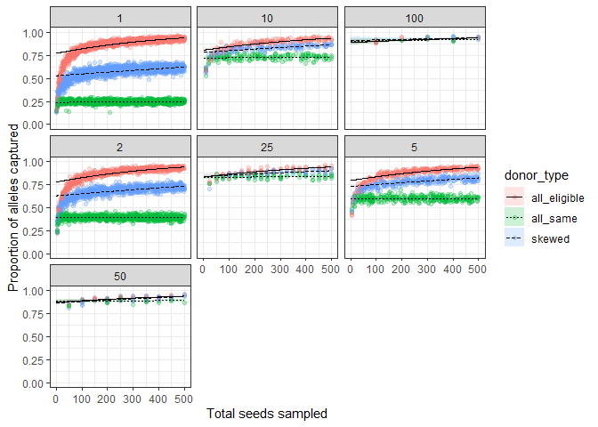<!-- -->

The fitted model doesn’t exactly match the data. Looking at the plotted
data points, you can see that the relationship is nonlinear, so a GLM
will not work perfectly. That nonlinear relationship is currently not
derived and would take a bit of work to do. To make this model more
accurate, a nonlinear model should be fitted to this data. One of the
biggest issues with the current model is the intercepts are not
representative of the data–they are much higher than they should be.
Intercepts for all curves should be 0, since 0 trees sampled = 0
diversity conserved. In the case of this model, higher intercepts
results in overestimating the amount of diversity one can capture in the
smaller sample sizes. Following the curve of the actual data points, we
see that when very few seeds are sampled, the diversity captured is low
for all donor types. Then, it quickly increases for skewed and
all\_eligible. However, the model here successfully provides the
parameter estimates of interest, with separate intercepts and slopes for
each number of maternal trees sampled, and each donor type within those
plots. The model predicts that scenarios with ‘all\_eligible’ pollen
donors will allow for the highest genetic diversity captured, and
‘all\_same’ to have the least diversity captured. Additionally, it
predicts that when more maternal trees are sampled, more diversity is
captured across all donor types. Particularly, as more maternal trees
are sampled, this highly influences the diversity captured for all\_same
scenarios. In nearly all scenarios, all\_eligible can capture close to
100% diversity if enough seeds are sampled. However, skewed and
especially all\_same scenarios are constricted based on their lower
number of possible pollen donors. Thus, to capture efficient diversity
with these more realistic pollen donation mechanisms, a greater number
of unique maternal trees needs to be sampled. These takeaways are
quantified and explored in more detail below.

-----

## Researching priors

Examining the default priors used in the model above:

``` r
priors = prior_summary(final_model)
priors
```

    ## Priors for model 'final_model' 
    ## ------
    ## Intercept (after predictors centered)
    ##  ~ normal(location = 0, scale = 2.5)
    ## 
    ## Coefficients
    ##   Specified prior:
    ##     ~ normal(location = [0,0,0,...], scale = [2.5,2.5,2.5,...])
    ##   Adjusted prior:
    ##     ~ normal(location = [0,0,0,...], scale = [ 0.018,11.119,37.350,...])
    ## 
    ## Covariance
    ##  ~ decov(reg. = 1, conc. = 1, shape = 1, scale = 1)
    ## ------
    ## See help('prior_summary.stanreg') for more details

``` r
priors$prior
```

    ## $dist
    ## [1] "normal"
    ## 
    ## $location
    ##  [1] 0 0 0 0 0 0 0 0 0 0 0 0 0 0 0 0 0 0 0 0 0 0 0 0 0 0 0 0 0 0 0 0 0 0 0 0 0 0
    ## [39] 0 0 0
    ## 
    ## $scale
    ##  [1] 2.5 2.5 2.5 2.5 2.5 2.5 2.5 2.5 2.5 2.5 2.5 2.5 2.5 2.5 2.5 2.5 2.5 2.5 2.5
    ## [20] 2.5 2.5 2.5 2.5 2.5 2.5 2.5 2.5 2.5 2.5 2.5 2.5 2.5 2.5 2.5 2.5 2.5 2.5 2.5
    ## [39] 2.5 2.5 2.5
    ## 
    ## $adjusted_scale
    ##  [1]  0.01751496 11.11896631 37.35006860  5.62955013 17.47558105  8.08724639
    ##  [7] 24.41065356  5.29293488  5.31321728  0.03812904  0.11090358  0.01884136
    ## [13]  0.05710333  0.02741139  0.08042841  0.01741151  0.01744933 19.17276562
    ## [19] 64.59495927  8.77938513 29.16858070 13.41925870 44.96883618 19.22744136
    ## [25] 66.85878717  8.73527018 31.10840030 13.91302816 37.35006860  0.06733028
    ## [31]  0.18964063  0.03028770  0.09629483  0.04688306  0.15340139  0.06579496
    ## [37]  0.17302767  0.03025629  0.09779000  0.04690537  0.12091550
    ## 
    ## $df
    ## NULL

The scaled priors are Normal(0, 2.5) for the intercept and all betas
(centered at 0 with a standard deviation of 2.5). The adjusted priors
show the priors on the original data scale. A Normal(0, 2.5) prior is
shown plotted below:

``` r
# Calculate the curve for Normal(0,2.5)
theta <- seq(-10, 10, 0.1)
prior2.5 <- dnorm(theta, mean=0, sd=2.5)
# Outline polygon for 1 sd area under the curve
auc_1_sd <- c(prior2.5[abs(theta) <= 1], 0, 0)
theta_uc <- c(theta[abs(theta) <= 1], 1, -1)
auc_df <- data.frame(theta_uc, auc_1_sd)
# Plot distribution and 1 sd under curve
data.frame(theta, prior2.5) %>% 
    ggplot() +
    geom_polygon(data=auc_df, 
                 mapping=aes(x=theta_uc, y=auc_1_sd), fill="grey") +
    geom_line(mapping=aes(x=theta, y=prior2.5)) +
    ylab("density")
```

<!-- --> The
default priors used here are okay to represent the data. Most of the
parameter values obtained in the model above (see summary code) fall
close to 0, with only a few parameters exceeding 1 standard deviation
from the mean.

-----

## Model checks/diagnostics

Shinystan won’t load on my pc due to a lack of memory, so here, I’ve
extracted a few parameters to determine if the chains have converged.

``` r
intercept_trace <- rstan::extract(final_model$stanfit, pars="alpha", permuted=FALSE)
data.frame(intercept_trace) %>% 
    mutate(iteration=1:n()) %>%
    pivot_longer(cols=starts_with("chain"),
                 names_to="chain",
                 values_to="alpha") %>%
    ggplot() +
    geom_line(mapping=aes(x=iteration, y=alpha, col=chain))
```

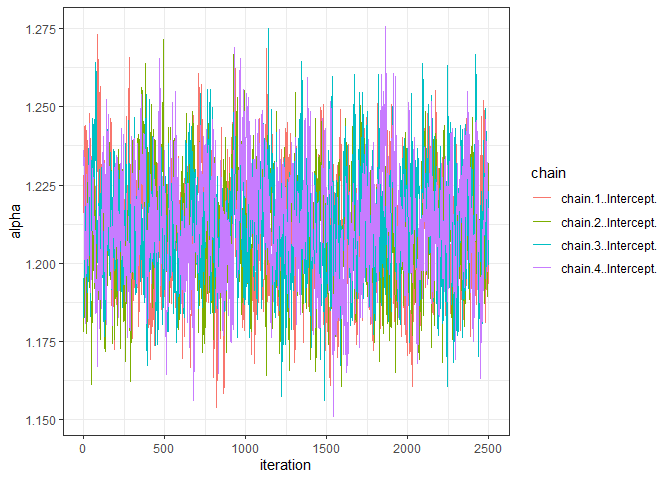<!-- -->

``` r
b1_trace <- rstan::extract(final_model$stanfit, pars="total_seeds", permuted=FALSE)
data.frame(b1_trace) %>% 
    mutate(iteration=1:n()) %>%
    pivot_longer(cols=starts_with("chain"),
                 names_to="chain",
                 values_to="alpha") %>%
    ggplot() +
    geom_line(mapping=aes(x=iteration, y=alpha, col=chain))
```

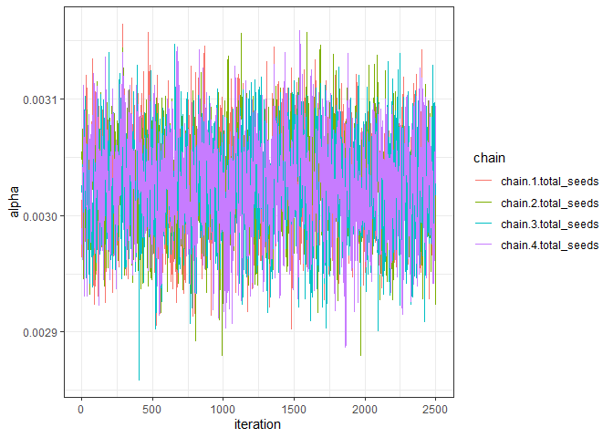<!-- -->

``` r
b10_trace <- rstan::extract(final_model$stanfit, pars="total_seeds:maternal_trees10", permuted=FALSE)
data.frame(b10_trace) %>% 
    mutate(iteration=1:n()) %>%
    pivot_longer(cols=starts_with("chain"),
                 names_to="chain",
                 values_to="alpha") %>%
    ggplot() +
    geom_line(mapping=aes(x=iteration, y=alpha, col=chain))
```

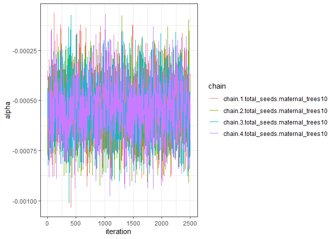<!-- -->

``` r
b36_trace <- rstan::extract(final_model$stanfit, pars="total_seeds:maternal_trees10:donor_typeskewed", permuted=FALSE)
data.frame(b36_trace) %>% 
    mutate(iteration=1:n()) %>%
    pivot_longer(cols=starts_with("chain"),
                 names_to="chain",
                 values_to="alpha") %>%
    ggplot() +
    geom_line(mapping=aes(x=iteration, y=alpha, col=chain))
```

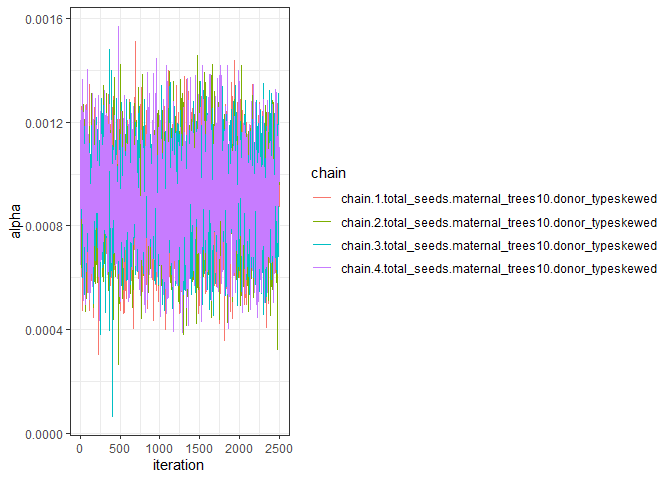<!-- --> From
the trace plots of these selected parameters, we can see that the chains
have converged.

``` r
#Distribution of observed data vs replications, overlaid densities
pp_check(final_model, plotfun = "ppc_dens_overlay_grouped", group="maternal_trees", nreps=30)
```

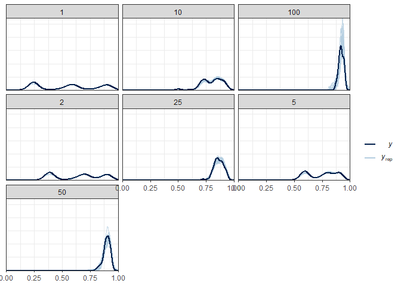<!-- --> In the
plot above, this simulated data does resemble the real data–the density
curves showing the real, observed data fits very well to the simulated
data. I grouped the data by maternal trees sampled. The 3 humps that are
seen on some of the plots (with fewer maternal trees sampled),
distinctly represent the three donor types–all\_same, skewed, and
all\_eligible. That’s because the difference in genetic diversity
captured between the donor types is strongest when fewer maternal trees
are sampled. We see those 3 humps merge into ont hump for the scenarios
with more maternal trees sampled, because in those scenarios, the
difference between pollen donor types is less drastic.

``` r
#Distribution of observed data vs replications, histograms
pp_check(final_model, plotfun = "hist")
```

    ## `stat_bin()` using `bins = 30`. Pick better value with `binwidth`.

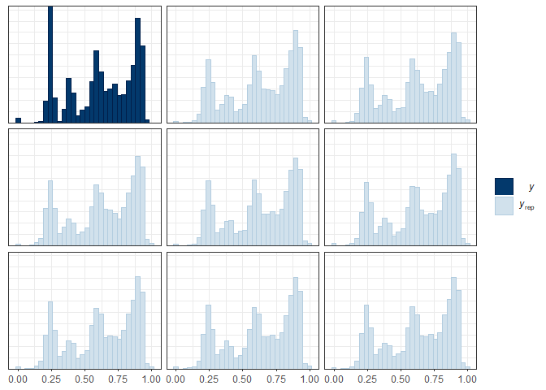<!-- --> In
general, the simulated data again closely resembles the observed data.
The simulated data doesn’t recreate that extremely tall bar shown in the
real data, so that particular area could use more investigation.

``` r
#Plotting residuals 
pp_check(final_model, plotfun = "error_hist", nreps = 6)
```

    ## `stat_bin()` using `bins = 30`. Pick better value with `binwidth`.

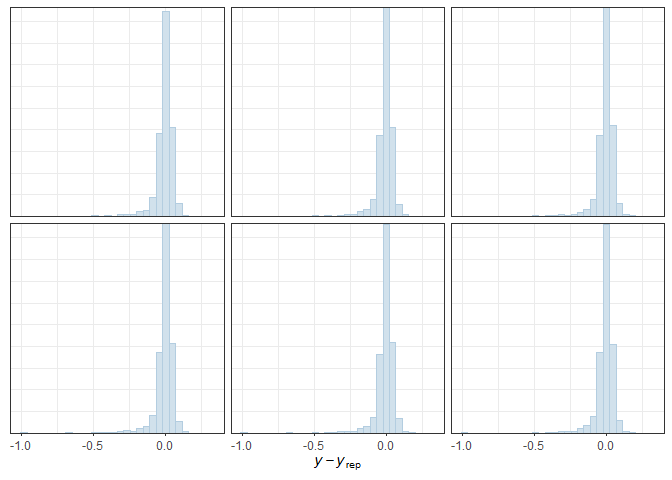<!-- --> The
residuals look relatively normal (slight skew) with small variation. All
residuals are pretty close to zero.

``` r
#Distributions of mean
pp_check(final_model, plotfun = "stat", stat = "mean")
```

    ## `stat_bin()` using `bins = 30`. Pick better value with `binwidth`.

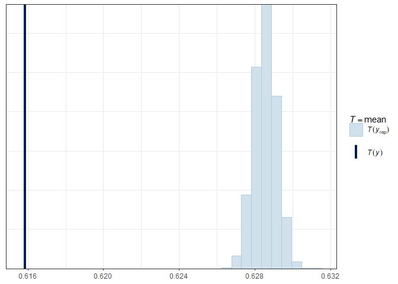<!-- --> The
simulated mean does not line up with the observed mean, but numerically,
the difference is small (0.615 to \~0.628). The observed mean is likely
lower than the simulated mean because the model does not accurately
predict values on the x-axis which are close to zero–it overestimates
those values compared to the real data.

``` r
# Distributions of standard deviation
pp_check(final_model, plotfun = "stat", stat = "sd")
```

    ## `stat_bin()` using `bins = 30`. Pick better value with `binwidth`.

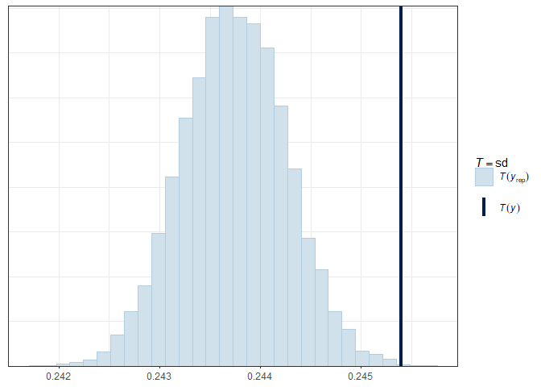<!-- --> Again,
the distribution of the standard deviation is not lining up with the
observed mean. The estimated standard deviation is slightly lower,
meaning the data has less spread than the observed data. Again, this is
the result of the model not predicting the lower values accurately.
However, the estimated sd doesn’t vary much numerically compared to the
observed (0.001-0.002 roughly).

``` r
#Scatterplot of y vs. average simulated y 
pp_check(final_model, plotfun = "scatter_avg")
```

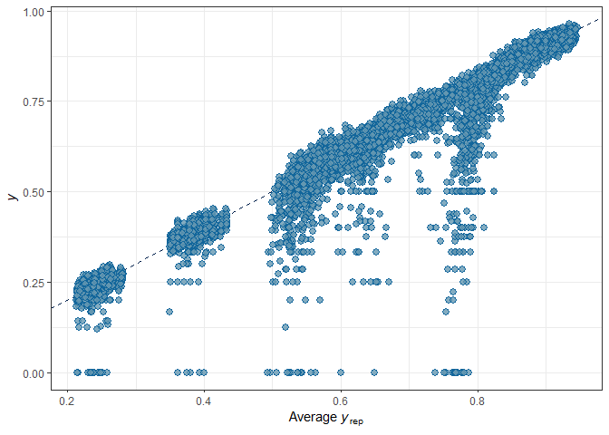<!-- --> Most of
the observed data lines up with the simulated data; however there are a
few values that don’t which fall close to zero on the observed data
scale. Again, this is likely because the model does not accurately
estimate the lower values of total seeds sampled properly (see fitted
model plotted with data). Overall, these plots show that the simulated
data varies slightly from the observed data due to the model not
predicting the lower values accurately. Numerically, the difference is
quite small though.

-----

## Model inferences

Comparing the differences in slopes between pollen donor types for a few
maternal tree scenarios. Here I’ve just selected a few scenarios due to
time constraints, but it would be interesting to repeat this for the
entire dataset (apologies for plotting everything separately, I would
make it more organized, but I am crunched for time :) ). Below, I
selected scenarios with 1 maternal tree and 50 maternal trees. 1
maternal tree is an interesting scenario because from the EDA, that’s
where we see the largest differences in pollen donation types in terms
of diversity captured. 50 maternal trees is where we see very small if
not negligible differences in the diversity captured between donor
types. Additionally, this is a common recommendation for sampling
guidelines–to sample 50 individuals in a population. I am not
investigating the impacts of other predictors (total seeds sampled,
number of maternal trees) directly, because those are well understood in
the literature (more trees sampled = more diversity, more seeds sampled
= more diversity, but not as much as sampling unique trees). I was
mostly interested in the interaction between pollen donor mechanisms,
the number of seeds sampled, and number of maternal trees sampled (i.e.,
determining how that relationship of diversity captured for each donor
type changes as more seeds are sampled and as more trees are sampled).

``` r
#Difference between all_same and all_eligible scenarios 
diff <- pmu[,1:500] - pmu[,501:1000]
diff_mn <- colMeans(diff)
n <- ncol(diff)
diff_cpi <- data.frame(difflo95=rep(NA,n), diffhi95=rep(NA,n))
for ( i in 1:n ) {
    diff_cpi[i,] <- quantile(diff[,i], prob=c(0.025,0.975))
}
diff_df <- data.frame(cbind(diff_mn, diff_cpi, total_seeds=newd$total_seeds[1:500]))
#Plotting the difference:
diff_df %>% 
    ggplot() +
    geom_ribbon(mapping=aes(x=total_seeds, ymin=difflo95, ymax=diffhi95), alpha=0.2) +
    geom_line(mapping=aes(x=total_seeds, y=diff_mn)) +
    xlab("Total seeds sampled") +
    ylab("Difference in diversity captured (all_eligible - all_same)")
```

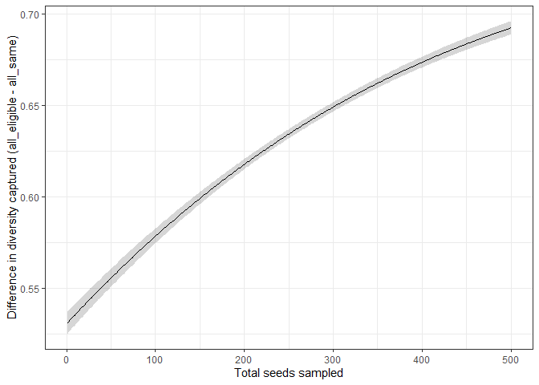<!-- --> From
this plot, we can see that the difference in genetic diversity captured
by all\_eligible and all\_same becomes greater as more seeds are sampled
from 1 maternal tree. Additionally, the difference in diversity captured
is really large between these two donor types\! All\_eligible scenarios
capture between 50 and 70% more than all\_same scenarios.

Comparing the differences in slopes between all\_eligible and skewed for
1 maternal tree

``` r
rm(diff_mn)
rm(diff_df)
#Difference between all_same and all_eligible scenarios 
diff <- pmu[,1:500] - pmu[,1001:1500]
diff_mn <- colMeans(diff)
n <- ncol(diff)
diff_cpi <- data.frame(difflo95=rep(NA,n), diffhi95=rep(NA,n))
for ( i in 1:n ) {
    diff_cpi[i,] <- quantile(diff[,i], prob=c(0.025,0.975))
}
diff_df <- data.frame(cbind(diff_mn, diff_cpi, total_seeds=newd$total_seeds[1:500]))
#Plotting the difference:
diff_df %>% 
    ggplot() +
    geom_ribbon(mapping=aes(x=total_seeds, ymin=difflo95, ymax=diffhi95), alpha=0.2) +
    geom_line(mapping=aes(x=total_seeds, y=diff_mn)) +
    xlab("Total seeds sampled") +
    ylab("Difference in diversity captured (all_eligible - all_same)")
```

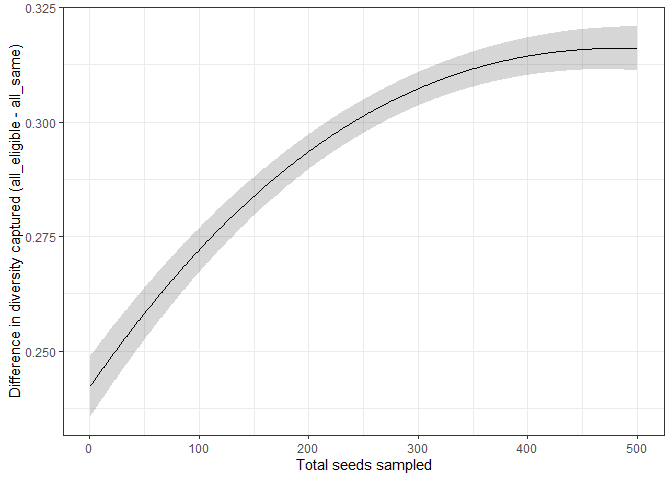<!-- --> The
difference in diversity captured for all\_eligible and skewed is less
drastic but still somewhat large, about 20-30% difference, again with
all\_eligible capturing the most diversity. Furthermore, over time, we
see the same trend of the difference becoming larger as more seeds are
sampled from one tree. This is because in skewed scenarios, there is a
constrained number of potential pollen donors (14), compared to
all\_eliglble, where all the trees in the population can pollinate
another. So the total diversity is limited in the case of skewed (and
all\_same) scenarios. Below, comparing skewed to all\_same:

``` r
rm(diff_mn)
rm(diff_df)
#Difference between all_same and all_eligible scenarios 
diff <- pmu[,1001:1500]- pmu[,501:1000] 
diff_mn <- colMeans(diff)
n <- ncol(diff)
diff_cpi <- data.frame(difflo95=rep(NA,n), diffhi95=rep(NA,n))
for ( i in 1:n ) {
    diff_cpi[i,] <- quantile(diff[,i], prob=c(0.025,0.975))
}
diff_df <- data.frame(cbind(diff_mn, diff_cpi, total_seeds=newd$total_seeds[1:500]))
#Plotting the difference:
diff_df %>% 
    ggplot() +
    geom_ribbon(mapping=aes(x=total_seeds, ymin=difflo95, ymax=diffhi95), alpha=0.2) +
    geom_line(mapping=aes(x=total_seeds, y=diff_mn)) +
    xlab("Total seeds sampled") +
    ylab("Difference in diversity captured (all_eligible - all_same)")
```

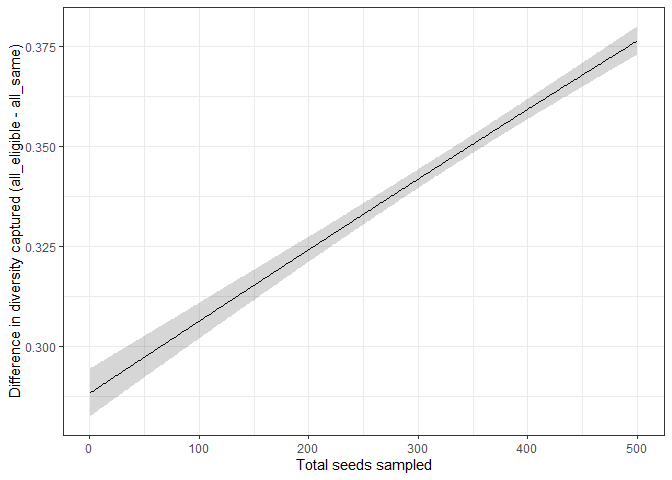<!-- --> The
difference between skewed and all\_same pollen mechanisms also becomes
larger as more seeds are sampled, and the difference ranges from 30-40%,
so slightly larger than comparing all\_eligible to skewed.

Comparing all\_eligible and all\_same for 50 maternal trees sampled.

``` r
rm(diff_mn)
rm(diff_df)
#Difference between all_same and all_eligible scenarios 
diff <- pmu[,7501:8000] - pmu[,8001:8500]
diff_mn <- colMeans(diff)
n <- ncol(diff)
diff_cpi <- data.frame(difflo95=rep(NA,n), diffhi95=rep(NA,n))
for ( i in 1:n ) {
    diff_cpi[i,] <- quantile(diff[,i], prob=c(0.025,0.975))
}
diff_df <- data.frame(cbind(diff_mn, diff_cpi, total_seeds=newd$total_seeds[1:500]))
#Plotting the difference:
diff_df %>% 
    ggplot() +
    geom_ribbon(mapping=aes(x=total_seeds, ymin=difflo95, ymax=diffhi95), alpha=0.2) +
    geom_line(mapping=aes(x=total_seeds, y=diff_mn)) +
    xlab("Total seeds sampled") +
    ylab("Difference in diversity captured (all_eligible - all_same)")
```

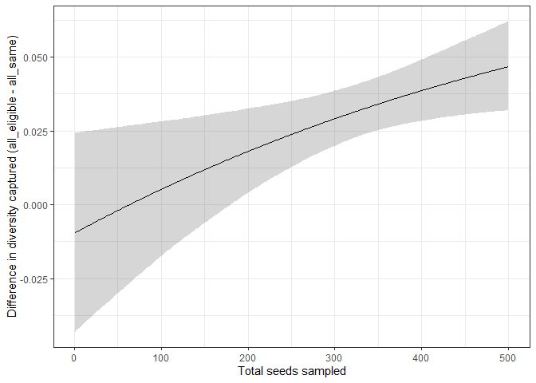<!-- --> The
difference between all\_eligible and all\_same (the pollen donor types
in which we would expect the greatest difference in diversity captured)
is now small, ranging from roughly 0-5%. What’s interesting is that the
model predicts that when fewer seeds are sampled, all\_same captures
more diversity than all\_eligible (see the negative difference on the
y-axis). This likely wouldn’t occur in reality, but since they are so
close anyway, it’s likely fine. This is an important finding–that the
pollen donor assumption doesn’t have a very large effect/difference in
diversity captured, because in practice, it is commonly recommended to
sample 50 individuals per population to capture a ‘sufficient’ amount of
genetic diversity. These results indicate that that recommendation is
robust to different pollen donation mechanisms and assumptions.

Overall, these plots indicate that the pollen donation mechanism for a
species of interest has a lot of influence on the genetic diversity
captured by a given sample size, particularly when a small number of
maternal trees is sampled. The simulation software Simcoal uses an
‘all\_eligible’ pollen donation mechanism, where all individuals in
the population can mate with one another, which is something typically
not seen in reality. Reality is closer to the ‘skewed’ mechanism, where
the closest trees are the ones mating with each other. This influences
the amount of diversity represented in the landscape, and thus
influences how many alleles one can capture in a given sample size. When
fewer maternal trees are sampled than the recommended guideline of 50
individuals, the pollen donation mechanism for the species of interest
may cause you to capture less diversity than expected.

-----

## Conclusions

Overall, though the model is not perfectly fitted to the data and I was
unable to complete the necessary posterior predictive checks to validate
the model, we can still get some important inferences from the model,
taking those caveats into consideration:  
1\. All\_eligible pollen donors will capture the most diversity across
most scenarios, followed by skewed and all\_same. However, this result
is strongest when few maternal trees are sampled. If 50 maternal trees
are sampled (the recommended guideline) there is a very small difference
in the diversity captured across pollen donor types.  
2\. The difference in diversity captured between donor types increases
as more seeds are sampled from a tree.  
3\. In almost all scenarios, the model predicts that all\_eligible
pollen donation can reach 100% alleles captured quickly. However, for
all\_same and skewed, more maternal trees need to be sampled in order to
reach close to 100% alleles captured.

To build on this project I would want to create a nonlinear model to
better represent the data and create more accurate predictions for
scenarios with a few seeds sampled. Additionally, I would want to
quantify the relationship between the number of maternal trees sampled
with these model inferences. Even though that relationship is mostly
known, it would be good to see how it varies based on the pollen donor
assumptions. Lastly, I would like to incorporate the number of seeds
sampled per tree in the model. Currently it is somewhat represented by
the predictor total\_seeds, but I would like to quantify the
relationship to determine what the tradeoff of sampling more seeds from
a single tree vs. sampling more unique maternal trees is. This is a
really important question in research. Overall, the data indicates that
sampling more seeds from a single tree can result in more diversity
captured, depending on the pollen donor assumptions (see plots of 1
maternal tree, data for all\_eligible and skewed curves up and levels
off at some point).
