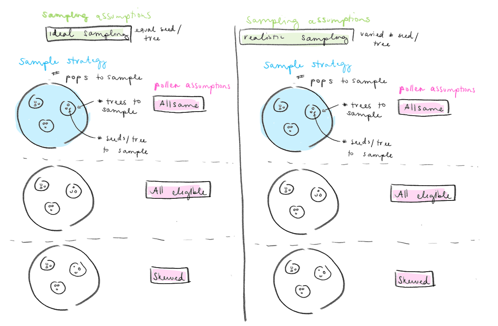
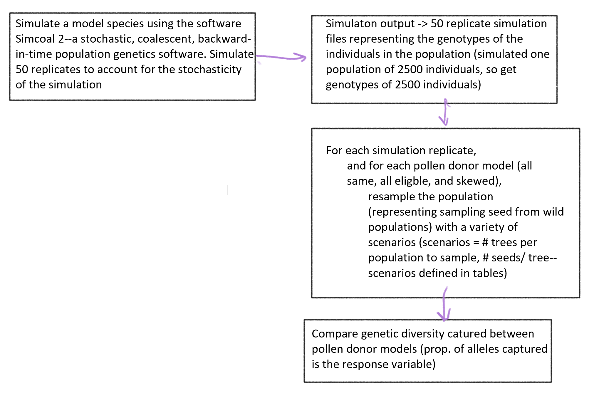

# Individual project proposal  
Kaylee Rosenberger  
DS4B Fall 2022  
Proposal for the individual course project  

BAM: Kaylee this looks interesting. Currently it looks like you have only fixed-effect grouping variables. I'm not sure if you'll end up with any random-effect grouping variables. You might but it will depend on the design, which I don't yet fully understand. Proportion of alleles captured might be a binomial response variable (rather than continuous), so this will likely be a GLM. Let's talk more about this.

### Project overview  
An overview of the project can be found [on the README of the Github repository for the project](https://github.com/kayleejorose/Pollen_dispersal_sims). Broadly, the goal of this body of work is to recommend **minimum sample sizes** to botanic gardens so that collectors can efficiently and effectively capture the genetic diversity of a species *ex situ*. In past studies, several important simplifications were made in determining these practical recommendations, and here we aimed to quantify the effects of these simplifications. In this project, we aimed to make more realistic assumptions than provided in the population genetics software [Simcoal](http://cmpg.unibe.ch/software/simcoal/), which is frequently used in creating these recommendations, and build on previous computational resampling studies to quantify the differences in genetic diversity captured based on a combintation of differenet pollen dispersal patterns and sampling techniques. 

### Dataset  
The population genetic dataset is created in Simcoal--the output of this program represents the genotypes of the individuals in that population. To account for the stochasticity in the output, we ran 50 replicates of the simulation, which vary in the total number of alleles simulated (by a small amount). Then, we create 'seeds' from the population (simulation output) based on a variety of different dispersal mechanisms--**all eligible** (all trees have equal probability to donate pollen to a given maternal tree), **all same** (one tree donates 100% of the pollen to a given maternal tree) and **skewed** (only a few trees are selected to donate pollen to a given maternal tree, with some having a higher probability to donate pollen). From here, these seed sets are sampled from (similar to sampling seed in the wild) using a variety of sampling scenarios (varying total number of seeds, number of trees sampled), and the genetic diversity captured is assessed. We would expect the total number of seeds sampled to impact the diversity captured (more seed = more diversity), and the donor type will have an impact as well (all same will result in lower genetic diversity captured than all eligible for example). A few of the sampling scenarios are shown in the tables below: 

#### Ideal scenarios 
This table represents **idealized** scenarios where an equal number of seeds are sampled per tree. This may not be possible in reality, as certain individuals may have higher reproductive output at a given time compared to others. 
| Num. maternal trees | Num. seeds per tree | Pollen donor mechanism | Total seeds sampled | 
| --- | --- | --- | --- |
| 100 | 1, 2, 3, 4, 5 | All eligible | 100, 200, 300, 400, 500 |
| 100 | 1, 2, 3, 4, 5 | All same | 100, 200, 300, 400, 500 |
| 100 | 1, 2, 3, 4, 5 | Skewed | 100, 200, 300, 400, 500 |
| ... | ... | ... | ... |
| 25 | 1, 2, 3...20 | All eligible | 25, 50, 75...500 |
| 25 | 1, 2, 3...20 | All same | 25, 50, 75...500 |
| 25 | 1, 2, 3...20 | Skewed | 25, 50, 75...500 |
| ... | ... | ... | ... |
| 1 | 1, 2, 3...500 | All eligible | 1, 2, 3...500 |
| 1 | 1, 2, 3...500 | All same | 1, 2, 3...500 |
| 1 | 1, 2, 3...500 | Skewed | 1, 2, 3...500 |

### Hypotheses
If sampling 1 seed per tree, the pollen donation types will not impact the diversity captured by the sampling strategy--instead, diversity captured will be reliant on the total sample size. In other words, sampling more maternal trees is more efficient than sampling multiple seeds from a few maternal trees.
However, when sampling a greater number of seeds per tree, the number of pollen donors will greatly impact the diversity captured for a given sample size. We would expect the 'all eligible' scenarios to capture the greatest amount of diversity, since it has the greatest number of potential pollen donors, followed by the 'skewed' scenarios, and the scenarios with one pollen donor will capture the least diversity. 

### Goals/questions 
I want to quantify the relative importance of each of the variables above to determine if the simplifications made in previous studies make a difference in terms of the genetic diversity captured by the sampling strategy. That is, is the total sample size more important than the pollen donation assumptions?   
Additionally, I hope to quantify the differences in diversity captured between each pollen donor type (e.g., comparing the slopes of the fitted curves). 

**Variables** are:  
- total seeds sampled, which can be broken down into: 
    - number of seeds sampled per tree (discrete, whole seeds)
    - number of maternal trees sampled (discrete, whole individuals)
- pollen donation mechanism (categorical--all same, all eligible, skewed)

From previous work, it is known that sampling 1 seed from 1 maternal tree is the most optimal method of sampling genetic diversity. So I'm mostly interested in how the pollen dispersal mechanism affects diversity capture. Then, I want to see how this influence changes over a number of sampling scenarios (num. maternal trees and num. seeds), because we might expect to see little difference in diversity capture when many unique maternal trees are sampled. However, this difference would become more apparent as fewer maternal trees are sampled, since most of the diversity would come from the pollen donors. See figures below:  
  

**Response variable** is the proportion of alleles captured--number of alleles captured by a sampling scenario/total number of alleles simulated (binomial response variable)

### Data design sketch
  
**NOTE: the procedure above is then done for 50 simulation replicates**  

### Study flow
  
  
***  
  
### Analysis:  
**Grouping variables:** The only grouping variable I can currently identify is the simulation replicate. Each of the 50 replicates have some amount of variation in the overall allelic diversity simulated. This is stochasic because the simulation process that generated this data is also stochastic. Then, we sample seed from each of the 50 simulation replicates using a variety of scenarios which are shown in the table above. We only complete one given sampling scenario 1 time for each replicate. The proportion of alleles captured for a given sampling scenario (e.g., 50 maternal trees and 1 seed per tree), can vary across these simulation replicates since the simulation replicates vary a little in diversity simulated, and the sampling is random, so by chance, more diversity may be captured in some scenarios. So in resampling each replicate, that is an additional source of variation.  
  
**Response variable:** The response variable is the proportion of alleles captured. Currently we have this represented as a proportion (continuous range from 0 to 1). The response variable will be binomially distributed.  
  
**Predictor variables:** The predictor variables are the total number of seeds sampled and the pollen donor type. The total seeds sampled could be broken into number of maternal trees sampled and number of seeds sampled per tree, but to keep things simple, I'll start with total number of seeds. 
